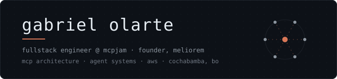

<div align="center">



<br><br>

[**olartgabo.dev**](https://olartgabo.dev) &nbsp;·&nbsp; [**LinkedIn**](https://linkedin.com/in/gabriel-olarte-medrano-741aa331a/) &nbsp;·&nbsp; [**olartgabo@gmail.com**](mailto:olartgabo@gmail.com)

</div>

<br>

I build systems that run in production and stay there.

Right now that means **fullstack engineering at [MCPJam](https://mcpjam.com)**, working on tooling for the Model Context Protocol ecosystem — I contributed MCP servers to the project as an outside contributor before joining the team. Alongside that I run **Meliorem**, an AI automation company with paying corporate clients on serverless AWS infrastructure.

Before this: represented Bolivia at **IOI 2025**, reached the **ICPC Latin America regional finals**, and founded the **first official AWS Cloud Club in Bolivia**.

<br>

---

## Selected work

| | | |
|---|---|---|
| **[MCPJam](https://mcpjam.com)** | Developer tooling for the Model Context Protocol. Contributed MCP servers to the open-source ecosystem, then joined full-time. | TypeScript · React · MCP |
| **Meliorem** | AI automation studio I founded. Corporate clients in production on event-driven AWS. | Lambda · SQS · API Gateway |
| **[Mosquit](https://github.com/olartgabo/mosquit)** | Environmental AI scanning system. **Top 500 of 25,000+** at Anthropic's Built with Claude hackathon. | Claude Agents · MCP · Python |
| **[CochaTech](https://cochatech.dev)** | Platform behind Bolivia's largest hackathon. **1,100+ participants** served in production. | Astro · Tailwind · AWS |
| **XploRA** | AR tourism platform with an active user base. Incubator prize winner. | React Native · AR · Node.js |
| **Kutik Inventory** | B2B logistics platform deployed across **8 departments of Bolivia**. | Node.js · PostgreSQL · AWS |
| **MercadoFuturo** | Prediction market built for LATAM — Polymarket-shaped, adapted to local payment rails. | TypeScript · PostgreSQL |
| **Javier** | Self-hosted AI assistant on a Raspberry Pi 5. Local LLM with a self-extending MCP tool layer. | Python · MCP · local inference |

<br>

---

## Competitive programming

```
IOI 2025          national representative, Bolivia
Ibero-American OI top 8 nationally
ICPC              Latin America regional finalist
```

<br>

---

## Stack

```
languages    TypeScript · Python · C++ · Java
ai/agents    Claude API · Model Context Protocol · LangChain · PyTorch
web          React · Astro · Node.js · Tailwind
cloud        AWS (Lambda, SQS, API Gateway, S3) · Docker · PostgreSQL
```

Certified through Anthropic on MCP, subagents, the Claude API, and Claude Code (7 certificates), plus AWS certification scholarships and Pearson C1 English.

<br>

---

## Currently

Reliable, composable multi-agent systems — the part of MCP architecture where tool composition stops being a demo and starts being infrastructure. Also thinking about why LATAM payment rails are still this fragmented, and about quantum computing, which is where I'd like to end up doing research.

<br>

<div align="center">

<sub>Open to conversations about agent infrastructure, MCP, and hard problems in LATAM tech.</sub>

</div>
